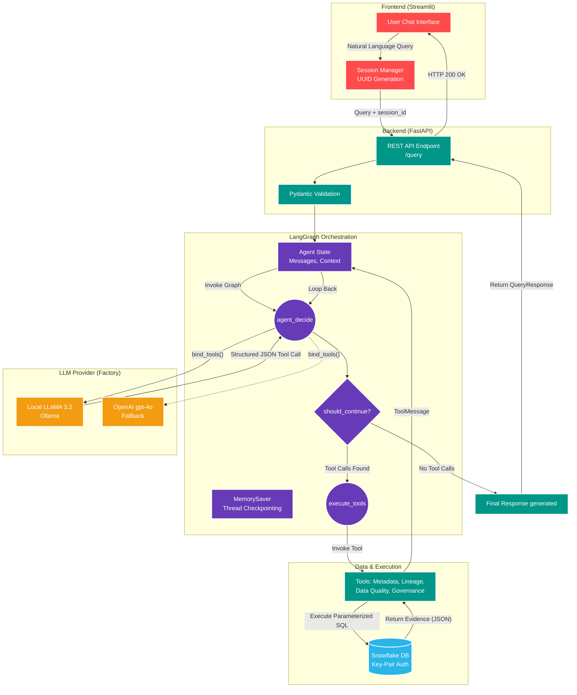

# Enterprise Snowflake Intelligence Agent

This repository contains the source code for the Enterprise Snowflake Intelligence Agent, an evidence-driven, retrieval-first AI agent designed for querying, discovering, and governing enterprise data assets in Snowflake.

## Features

- **Agentic Workflow**: Utilizes LangGraph for a strict Intent Classification -> Routing -> Planning -> Retrieval -> Validation loop.
- **Evidence-Driven**: The agent refuses to hallucinate and strictly relies on retrieved metadata and data.
- **Tools**: Includes tools for Metadata, Documentation, Lineage, Governance, Cortex Search, SQL Generation, and Query Execution.
- **Production Ready**: Built with a FastAPI backend and a Streamlit frontend for demonstration.

## Setup

1. **Install Dependencies**:
   ```bash
   pip install -r requirements.txt
   ```

2. **Environment Variables**:
   Create a `.env` file in the root directory with the following variables:
   ```env
   OPENAI_API_KEY=your_openai_api_key
   SNOWFLAKE_ACCOUNT=your_account
   SNOWFLAKE_USER=your_user
   SNOWFLAKE_PASSWORD=your_password
   SNOWFLAKE_ROLE=your_role
   SNOWFLAKE_WAREHOUSE=your_warehouse
   SNOWFLAKE_DATABASE=your_database
   SNOWFLAKE_SCHEMA=your_schema
   ```

3. **Run the API (Backend)**:
   ```bash
   uvicorn app.api.main:app --reload
   ```

4. **Run the UI (Frontend)**:
   ```bash
   streamlit run app/ui/streamlit_app.py
   ```

## Architecture


